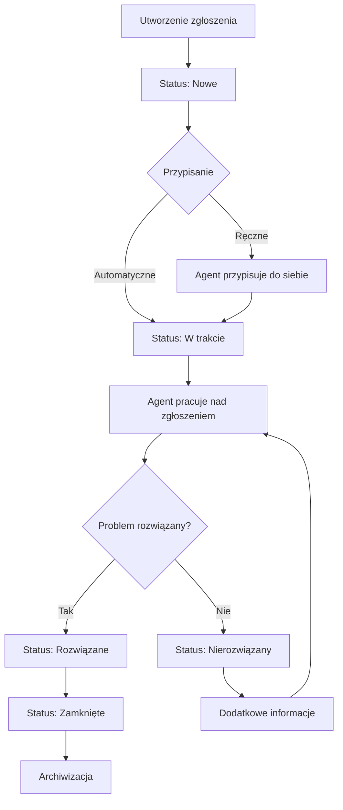

# 3. Opis systemu

## 3.1 Funkcjonalności kluczowe

### 3.1.1 Zarządzanie zgłoszeniami

#### Tworzenie zgłoszeń:
- **Formularz zgłoszenia** - intuicyjny interfejs do tworzenia nowych zgłoszeń
- **Kategorie problemów** - sprzęt, oprogramowanie, sieć, konto, inne
- **Priorytety** - niski, średni, wysoki, krytyczny
- **Automatyczne sugerowanie kategorii** - AI pomaga w klasyfikacji zgłoszeń
- **Załączniki** - możliwość dodawania plików z automatycznym szyfrowaniem

#### Śledzenie zgłoszeń:
- **Statusy zgłoszeń**:
  - Nowe - świeżo utworzone zgłoszenie
  - W trakcie - zgłoszenie jest obsługiwane
  - Nierozwiązany - zgłoszenie wymaga dodatkowych informacji
  - Rozwiązane - problem został rozwiązany
  - Zamknięte - zgłoszenie zostało zamknięte

#### Przypisywanie zgłoszeń:
- **Automatyczne przypisywanie** - system może automatycznie przypisać zgłoszenia
- **Ręczne przypisywanie** - agenci mogą przypisywać zgłoszenia do siebie
- **Przypisywanie przez super agentów** - możliwość przypisywania innym agentom
- **Historia przypisań** - śledzenie zmian przypisań

### 3.1.2 System powiadomień

#### Powiadomienia email:
- **Nowe zgłoszenie** - powiadomienie o utworzeniu zgłoszenia
- **Przypisanie** - powiadomienie o przypisaniu zgłoszenia
- **Zmiana statusu** - powiadomienie o zmianie statusu
- **Nowy komentarz** - powiadomienie o dodaniu komentarza
- **Zamknięcie** - powiadomienie o zamknięciu zgłoszenia

#### Konfiguracja powiadomień:
- **Ustawienia użytkownika** - każdy użytkownik może skonfigurować swoje powiadomienia
- **Szablony email** - możliwość dostosowania treści powiadomień
- **Częstotliwość** - kontrola nad częstotliwością powiadomień

### 3.1.3 Raporty i statystyki

#### Dashboard główny:
- **Przegląd zgłoszeń** - liczba zgłoszeń według statusu
- **Statystyki wydajności** - czas rozwiązywania, liczba zamkniętych zgłoszeń
- **Wykresy** - wizualizacja danych w czasie
- **Filtry** - możliwość filtrowania według różnych kryteriów

#### Raporty szczegółowe:
- **Raport agentów** - wydajność poszczególnych agentów
- **Raport organizacji** - statystyki według organizacji
- **Raport czasowy** - analiza trendów w czasie
- **Eksport danych** - możliwość eksportu do Excel/CSV

## 3.2 Role użytkowników

### 3.2.1 Administrator
**Pełny dostęp do systemu**

#### Uprawnienia:
- Zarządzanie wszystkimi użytkownikami i rolami
- Konfiguracja systemu i ustawień
- Dostęp do wszystkich zgłoszeń
- Zarządzanie organizacjami
- Dostęp do logów systemowych
- Zarządzanie kopiami zapasowymi

#### Funkcje:
- Tworzenie i edycja kont użytkowników
- Przypisywanie ról i uprawnień
- Konfiguracja kategorii i priorytetów
- Zarządzanie ustawieniami email
- Monitorowanie bezpieczeństwa systemu

### 3.2.2 Super Agent
**Zarządzanie zgłoszeniami i agentami**

#### Uprawnienia:
- Przypisywanie zgłoszeń innym agentom
- Zmiana przypisań już przypisanych zgłoszeń
- Edycja wszystkich zgłoszeń
- Zamykanie dowolnych zgłoszeń
- Dostęp do statystyk i raportów
- Zarządzanie organizacjami

#### Funkcje:
- Nadzór nad pracą agentów
- Rozdzielanie zgłoszeń między agentów
- Rozwiązywanie skomplikowanych problemów
- Analiza wydajności zespołu

### 3.2.3 Agent
**Obsługa przypisanych zgłoszeń**

#### Uprawnienia:
- Przypisywanie nieprzydzielonych zgłoszeń do siebie
- Cofanie przypisania własnych zgłoszeń
- Zamykanie przypisanych zgłoszeń
- Dodawanie komentarzy i załączników
- Dostęp do zgłoszeń swojej organizacji

#### Funkcje:
- Obsługa przypisanych zgłoszeń
- Komunikacja z klientami
- Aktualizacja statusu zgłoszeń
- Dokumentowanie rozwiązań

### 3.2.4 Klient
**Zgłaszanie problemów i śledzenie statusu**

#### Uprawnienia:
- Tworzenie nowych zgłoszeń
- Przeglądanie własnych zgłoszeń
- Dodawanie komentarzy do swoich zgłoszeń
- Śledzenie statusu zgłoszeń
- Dostęp do historii zgłoszeń

#### Funkcje:
- Zgłaszanie problemów technicznych
- Komunikacja z działem IT
- Śledzenie postępu zgłoszeń
- Ocenianie jakości obsługi

### 3.2.5 Viewer
**Tylko podgląd zgłoszeń**

#### Uprawnienia:
- Przeglądanie zgłoszeń (tylko odczyt)
- Brak możliwości edycji
- Brak możliwości tworzenia zgłoszeń
- Dostęp tylko do zgłoszeń swojej organizacji

#### Funkcje:
- Monitorowanie zgłoszeń
- Analiza trendów problemów
- Raportowanie dla zarządu

## 3.3 Przepływ pracy

### 3.3.1 Cykl życia zgłoszenia

### 3.3.2 Proces przypisywania

1. **Zgłoszenie zostaje utworzone** przez klienta
2. **System automatycznie sugeruje kategorię** na podstawie opisu
3. **Super Agent lub Agent przypisuje zgłoszenie**:
   - Do siebie (Agent)
   - Do innego agenta (Super Agent)
   - Pozostawia nieprzydzielone
4. **Powiadomienie email** zostaje wysłane do przypisanego agenta
5. **Agent rozpoczyna pracę** nad zgłoszeniem

### 3.3.3 Proces rozwiązywania

1. **Agent analizuje problem** opisany w zgłoszeniu
2. **Dodaje komentarze** z postępem prac
3. **Może poprosić o dodatkowe informacje** (zmiana statusu na "Nierozwiązany")
4. **Po rozwiązaniu** zmienia status na "Rozwiązane"
5. **Klient potwierdza rozwiązanie** lub zgłasza dodatkowe problemy
6. **Zgłoszenie zostaje zamknięte** przez agenta lub super agenta

## 3.4 Bezpieczeństwo

### 3.4.1 Uwierzytelnianie
- **Logowanie** - standardowe logowanie z hasłem
- **Uwierzytelnianie dwuskładnikowe (2FA)** - Google Authenticator
- **Blokada kont** - po 5 nieudanych próbach logowania
- **Zaufane urządzenia** - możliwość zapamiętania urządzenia na 30 dni

### 3.4.2 Autoryzacja
- **Kontrola dostępu na poziomie ról** - różne uprawnienia dla różnych ról
- **Kontrola dostępu do organizacji** - użytkownicy widzą tylko swoje organizacje
- **Kontrola dostępu do zgłoszeń** - ograniczenia według przypisań i organizacji

### 3.4.3 Szyfrowanie
- **Załączniki** - automatyczne szyfrowanie wszystkich załączników
- **Klucze szyfrowania** - unikalny klucz dla każdego pliku
- **Bezpieczne przechowywanie** - klucze przechowywane w bazie danych

### 3.4.4 Logowanie
- **Logi aktywności** - wszystkie działania są logowane
- **Logi bezpieczeństwa** - nieudane próby logowania, blokady kont
- **Logi systemowe** - błędy systemu, operacje administracyjne
- **Retencja logów** - możliwość konfiguracji czasu przechowywania
