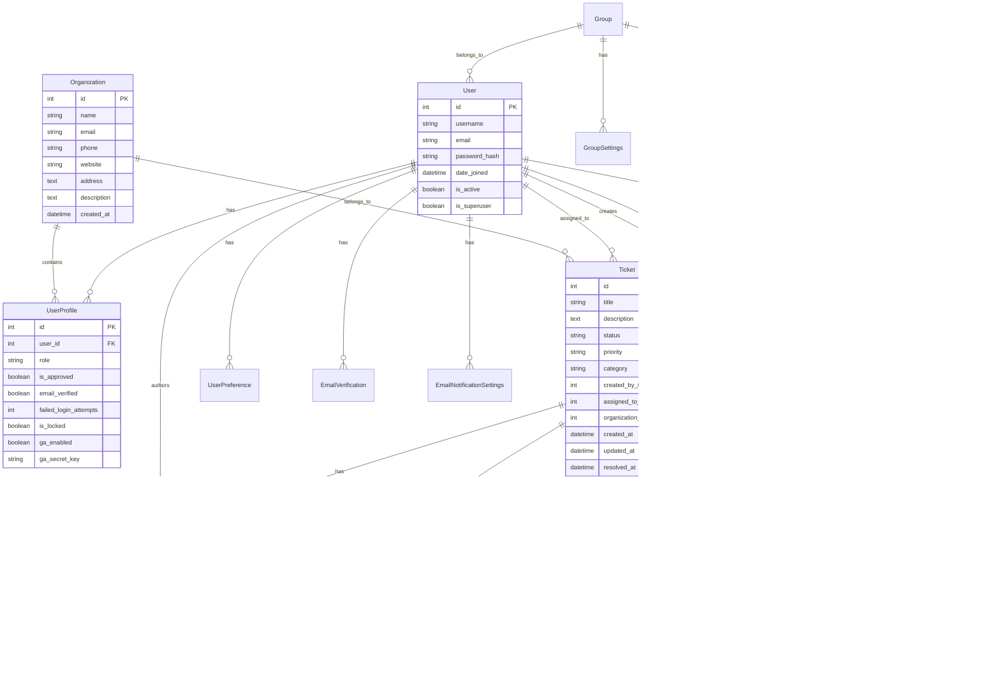

# 6. Architektura i technologia

## 6.1 Diagramy architektury

### 6.1.1 Architektura systemu


### 6.1.2 Schemat bazy danych



## 6.2 Technologie użyte

### 6.2.1 Backend

#### Django Framework
- **Wersja:** Django 4.2.22
- **Cel:** Główny framework aplikacji webowej
- **Funkcje:** MVC pattern, ORM, autentykacja, administracja

#### Python
- **Wersja:** Python 3.8 - 3.12
- **Cel:** Język programowania backendu
- **Biblioteki:** cryptography, pillow, pyotp, qrcode

#### Baza danych
- **SQLite** - dla rozwoju i testowania
- **MySQL** - dla produkcji
- **ORM:** Django ORM z migracjami

### 6.2.2 Frontend

#### HTML5/CSS3
- **Semantyczny HTML** - struktura strony
- **Responsive CSS** - dostosowanie do urządzeń mobilnych
- **Bootstrap 4** - framework CSS

#### JavaScript
- **Vanilla JavaScript** - podstawowa funkcjonalność
- **AJAX** - komunikacja z backendem
- **Polling** - odświeżanie danych w czasie rzeczywistym

### 6.2.3 Bezpieczeństwo

#### Szyfrowanie
- **Cryptography** - biblioteka Python do szyfrowania
- **Fernet** - symetryczne szyfrowanie załączników
- **Base64** - kodowanie kluczy

#### Uwierzytelnianie
- **Django Auth** - podstawowe uwierzytelnianie
- **Google Authenticator** - 2FA (TOTP)
- **PyOTP** - generowanie kodów TOTP
- **QRCode** - generowanie kodów QR

### 6.2.4 Powiadomienia

#### Email
- **Django Email** - system powiadomień email
- **SMTP** - protokół wysyłania emaili
- **Templates** - szablony emaili HTML/TXT

### 6.2.5 Narzędzia deweloperskie

#### Testowanie
- **pytest** - framework testowy
- **pytest-django** - integracja z Django
- **selenium** - testy end-to-end
- **factory-boy** - generowanie danych testowych

#### Zarządzanie zależnościami
- **pip** - instalacja pakietów Python
- **requirements.txt** - lista zależności
- **Virtual Environment** - izolacja środowiska

## 6.3 Integracje

### 6.3.1 Email (SMTP)

#### Konfiguracja
```python
EMAIL_BACKEND = 'django.core.mail.backends.smtp.EmailBackend'
EMAIL_HOST = 'smtp.gmail.com'
EMAIL_PORT = 587
EMAIL_USE_TLS = True
EMAIL_HOST_USER = 'your-email@gmail.com'
EMAIL_HOST_PASSWORD = 'your-app-password'
```

#### Szablony email
- **Lokalizacja:** `templates/emails/`
- **Formaty:** HTML i TXT
- **Zmienne:** Django template variables

### 6.3.2 Google Authenticator

#### Implementacja 2FA
```python
# Generowanie klucza TOTP
import pyotp
secret = pyotp.random_base32()
totp = pyotp.TOTP(secret)

# Weryfikacja kodu
code = request.POST.get('code')
if totp.verify(code):
    # Kod poprawny
```

#### QR Code
```python
# Generowanie QR kodu
import qrcode
from io import BytesIO

qr = qrcode.QRCode(version=1, box_size=10, border=5)
qr.add_data(f"otpauth://totp/{username}?secret={secret}&issuer={issuer}")
qr.make(fit=True)
```

### 6.3.3 System plików

#### Przechowywanie załączników
- **Lokalizacja:** `public/media/ticket_attachments/`
- **Szyfrowanie:** Fernet encryption
- **Bezpieczeństwo:** Unikalny klucz dla każdego pliku

#### Backup
- **MySQL dump** - pełna kopia bazy danych
- **JSON export** - uniwersalny format
- **Kompresja** - gzip compression
- **Rotacja** - automatyczne usuwanie starych kopii

## 6.4 Struktura projektu

### 6.4.1 Organizacja katalogów

```
projekt-wdrozeniowy/
├── crm/                          # Główna aplikacja Django
│   ├── models.py                 # Modele danych
│   ├── views/                    # Widoki aplikacji
│   │   ├── auth_views.py         # Uwierzytelnianie
│   │   ├── dashboard_views.py    # Panel główny
│   │   ├── tickets/              # Zarządzanie zgłoszeniami
│   │   └── statistics_views.py   # Statystyki
│   ├── templates/                # Szablony HTML
│   │   ├── crm/                  # Szablony aplikacji
│   │   └── emails/               # Szablony emaili
│   ├── static/                   # Pliki statyczne
│   │   ├── css/                  # Style CSS
│   │   └── js/                   # Skrypty JavaScript
│   ├── services/                 # Logika biznesowa
│   │   └── email/                # Serwisy email
│   ├── management/               # Komendy Django
│   │   └── commands/             # Komendy zarządzania
│   └── migrations/               # Migracje bazy danych
├── projekt_wdrozeniowy/          # Konfiguracja Django
│   ├── settings.py              # Ustawienia
│   ├── urls.py                  # Routing URL
│   └── wsgi.py                  # WSGI configuration
├── static/                       # Pliki statyczne globalne
├── Dokumentacja/                 # Dokumentacja projektu
├── requirements.txt              # Zależności Python
└── manage.py                     # Skrypt zarządzania Django
```

### 6.4.2 Kluczowe komponenty

#### Models (crm/models.py)
- **UserProfile** - rozszerzenie modelu User
- **Organization** - organizacje klientów
- **Ticket** - zgłoszenia IT
- **TicketComment** - komentarze do zgłoszeń
- **TicketAttachment** - załączniki z szyfrowaniem
- **ActivityLog** - logi aktywności
- **EmailVerification** - weryfikacja emaili

#### Views
- **auth_views.py** - logowanie, rejestracja, 2FA
- **dashboard_views.py** - panel główny
- **tickets/** - zarządzanie zgłoszeniami
- **statistics_views.py** - raporty i statystyki

#### Services
- **email/** - serwisy email
- **core.py** - podstawowe funkcje
- **encryption.py** - szyfrowanie plików

#### Templates
- **Bootstrap 4** - responsywny design
- **Django templates** - dynamiczne treści
- **AJAX** - interaktywne elementy

## 6.5 Bezpieczeństwo architektury

### 6.5.1 Warstwy bezpieczeństwa

#### Warstwa aplikacji
- **CSRF protection** - ochrona przed atakami CSRF
- **XSS protection** - ochrona przed skryptami
- **SQL injection** - ochrona przez ORM Django
- **Session security** - bezpieczne sesje

#### Warstwa danych
- **Szyfrowanie załączników** - Fernet encryption
- **Hashowanie haseł** - Django password hashing
- **Kontrola dostępu** - role-based permissions

#### Warstwa sieciowa
- **HTTPS** - szyfrowanie komunikacji
- **Firewall** - kontrola dostępu do portów
- **Rate limiting** - ograniczenie prób logowania

### 6.5.2 Monitoring bezpieczeństwa

#### Logi bezpieczeństwa
- **Nieudane logowania** - tracking failed attempts
- **Blokady kont** - automatic account locking
- **Podejrzane aktywności** - unusual access patterns
- **Audit trail** - complete activity logging

#### Alerty
- **Email notifications** - security alerts
- **Log monitoring** - real-time log analysis
- **Performance monitoring** - system health checks
